<h1 align="left">Hi!, I'm Cléo Lima</h1>

 

- Always studying <code>React</code>, <code>Next JS</code>, <code>Node.js</code> and the **_best practices_** for programming.
    
- <a>
  

    I’m currently learning 
        
        
        
  

</a>

- **Fun fact:** I used to be a **_Counter-Strike pro-player_** in Brazil.

- Feel free to ask me anything about **_coding_** and my **_live stream_**.

 
 
 
 
 
 
 
 
<!---->

## My Development Stack

**Frontend:**

  <code></code>
  <code></code>
  <code></code>
  <code></code>
  <code></code>
  <code></code>
  <code></code>
  <code></code>
  <code></code>
  <code>-fa6eb4?style=for-the-badge"></code>
  <code></code>
  <code></code>
  <code></code>

 

**Backend:**

  <code></code>
  <code></code>
  <code></code>
  <code></code>

 

**Observability:**

  <code></code>
  <code></code>

 

**AI & Productivity:**

  <code></code>
  <code></code>
  <code></code>
  <code></code>

 

**DevOps & Tools:**

<code></code>
<code></code>
<code></code>

 

**Business Tools**

<code></code>
<code></code>
<code></code>
<code></code>

##

${\color{#fa6eb4}You \space can \space reach \space me \space with \space the \space links \space below:}$

  
  
  
  
  
  

